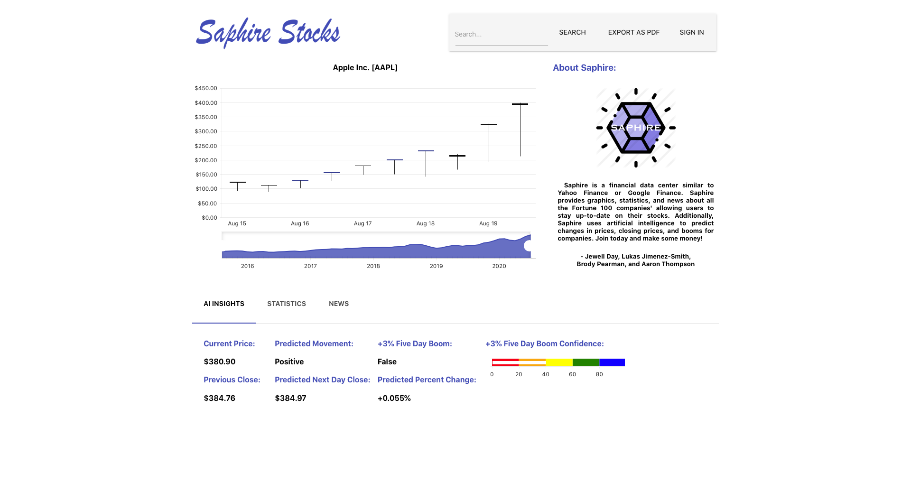
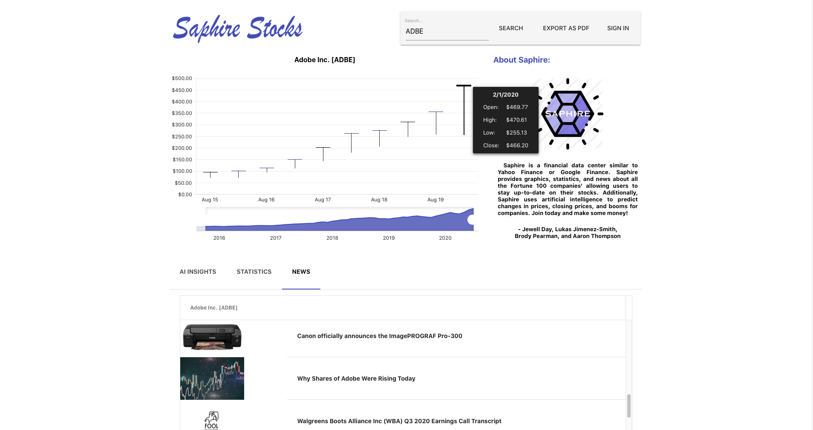
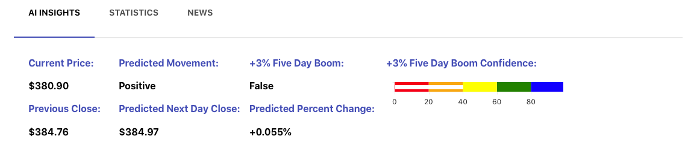
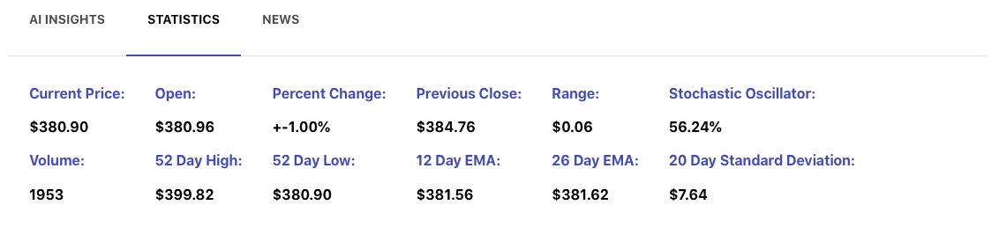
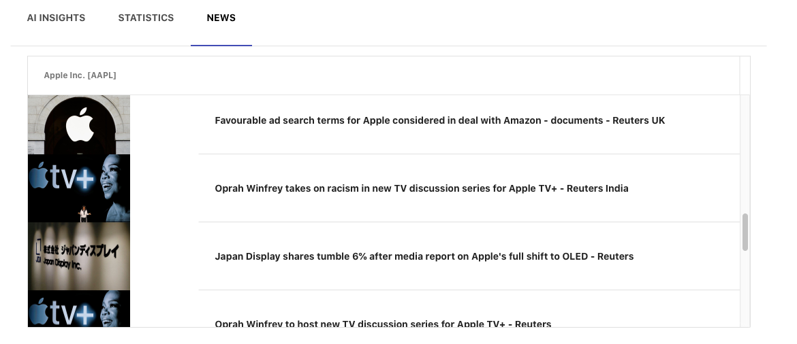
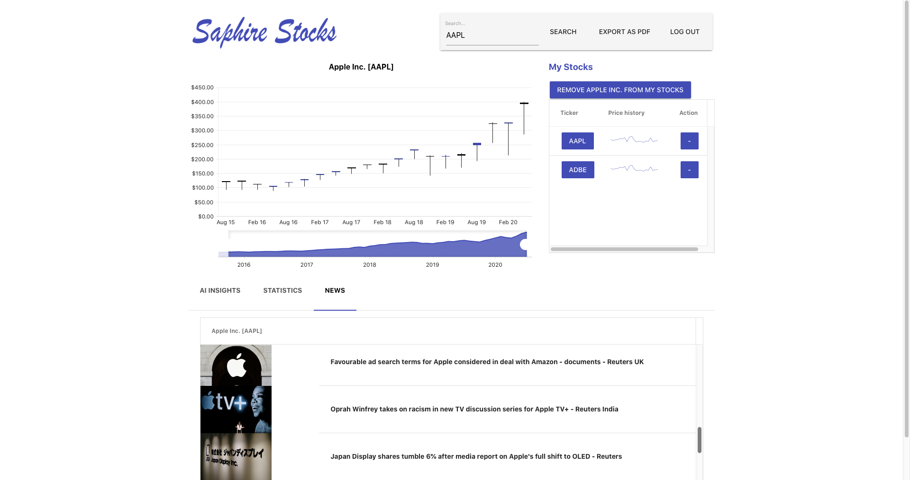

# SAPHIRE (Stock AI Predictor for Hire)
SAPHIRE is a stock management web application that allows users to keep tabs on their stock portfolio using a combination of news sources and machine learning powered metrics. This site was implemented using React, Django, Postgres, Redis, Celery, and machine learning models written from scratch in Python.

Prior to running, make sure to install Docker: https://docs.docker.com/get-docker/

In a bash terminal run:
chmod +x initialize_project.sh
./initialize_project.sh
docker-compose up

The Initialization script will take a while because it updates the database with all of the stock data from the past 5 years. Currently, the script only updates the fortune 100 stocks for the sake of time. 

The site can be accessed on localhost:3000

## Initial Screen for SAPHIRE

Here is the initial screen for the website. The user has access to all sorts of different tabs and data visualizations for the stock that they are currently viewing. 

## Search Functionality

The user can search for their favorite stock based on the company ticker. In this case, the user searched for Adobe (ADBE).

## Predictions Tab

Predictive metrics powered by machine learning can be viewed. The metrics are derived using a combination of neural networks and genetic algorithms.

## Statistics Tab

Stats for the currently viewed stock are located here.

## News Tab

The news tab gives the user access to news stories from around the web for the currently viewed company.

## Watched Companies List

The user can keep track of a list of companies using the "My Stocks" functionality. 